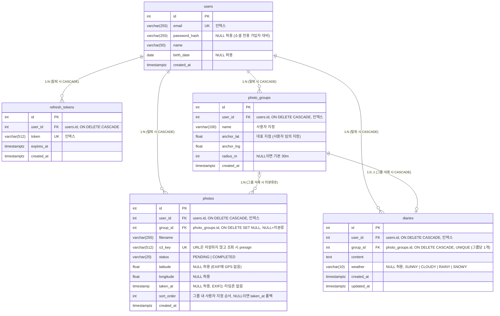

# ERD

스키마 변경 시 이 문서와 Alembic 마이그레이션을 같은 PR에 포함한다.

## 설계 메모

- **refresh_tokens**: 로그인/refresh마다 1행 저장. refresh 시 rotation(기존 행 삭제 후 재발급),
  로그아웃 시 해당 행 삭제, 회원 탈퇴 시 CASCADE로 전체 무효화 (SRS 2.1.3).
- **users.password_hash NULL**: 소셜 전용 가입자는 비밀번호가 없다(이메일 로그인 시도 시 401).
  현재는 이메일 가입만 있어 항상 채워지지만, 소셜 로그인 추가에 대비해 nullable을 유지한다.
  소셜 provider를 붙일 때는 `auth_provider` + `provider_user_id`(문자열) 페어를 새 컬럼으로
  추가한다(provider 무관하게 1쌍으로 처리).
- **photo_groups**: 사용자가 직접 만드는 대표 여행지. `anchor` 좌표 반경(`radius_m`,
  기본 30m) 이내의 사진이 자동 배정된다. 생성/수정 시 미분류 사진을 재스캔해 편입하고,
  앵커·반경 변경으로 반경을 벗어난 사진은 미분류로 되돌린다. 그룹 삭제 시 사진은
  삭제하지 않고 미분류(`group_id=null`)로만 되돌린다.
- **photos**: 파일 바이트는 S3에만 저장 (Presigned PUT 직접 업로드, Lambda 6MB 제한 회피).
  DB에는 `s3_key`만 유지하고 응답 URL은 조회 시점에 presign한다. `complete` 통보 시
  EXIF에서 GPS·촬영일시를 추출하며, GPS가 없으면 좌표 NULL + 미분류로 저장한다.
  `sort_order`는 그룹 내 사용자 지정 순서로, 전체 ID 배열을 PUT으로 받아 일괄 갱신한다.
- **diaries**: 방문지(사진 그룹) 단위 일기, 그룹당 1개(UNIQUE). PUT upsert로 작성/수정을
  한 엔드포인트로 처리한다. 그룹 삭제 시 일기도 CASCADE 삭제 — 사진과 달리 그룹 밖에서는
  접근 경로가 없기 때문. 날씨는 선택 항목(NULL 허용).
- (기존 `photo_locations` 임시 테이블은 `photos`로 대체되어 삭제됨.)
