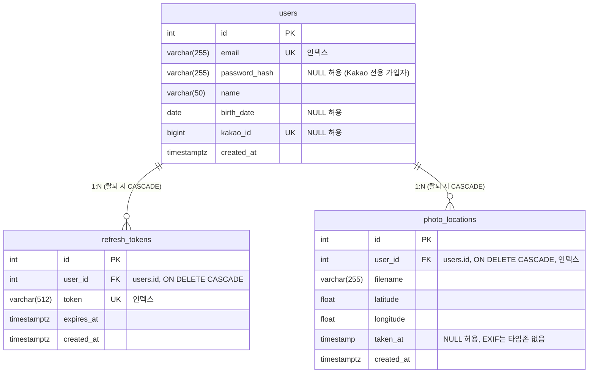

# ERD

스키마 변경 시 이 문서와 Alembic 마이그레이션을 같은 PR에 포함한다.

## 설계 메모

- **refresh_tokens**: 로그인/refresh마다 1행 저장. refresh 시 rotation(기존 행 삭제 후 재발급),
  로그아웃 시 해당 행 삭제, 회원 탈퇴 시 CASCADE로 전체 무효화 (SRS 2.1.3).
- **users.password_hash NULL**: Kakao로만 가입한 사용자는 비밀번호가 없다.
  이메일 로그인 시도 시 401 처리.
- **users.kakao_id**: Kakao 회원번호(BigInteger). 같은 이메일의 기존 계정에
  Kakao 로그인하면 이 컬럼을 채워 계정을 연결한다.
- **photo_locations**: EXIF 좌표 파싱 검증용 임시 테이블. 사진 바이트는 서버 메모리에서
  파싱 후 폐기하고 좌표·촬영일시만 저장한다. Week 3에 S3 Presigned 기반 `photos`로
  대체 예정 — 그때 이 테이블은 삭제한다.
