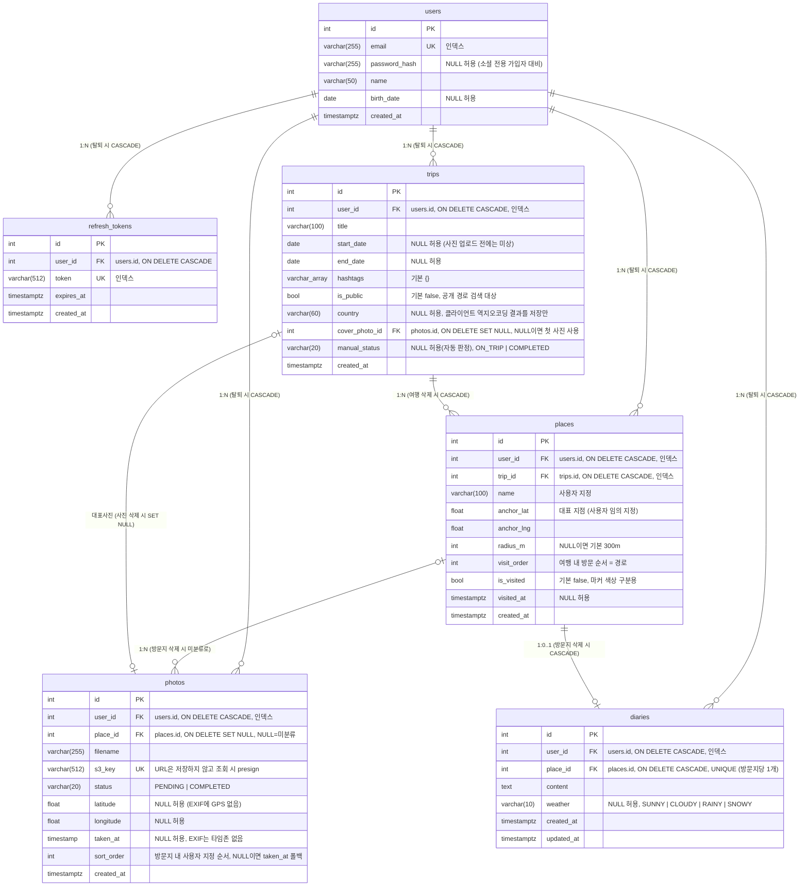

# ERD

스키마 변경 시 이 문서와 Alembic 마이그레이션을 같은 PR에 포함한다.

## 설계 메모

- **refresh_tokens**: 로그인/refresh마다 1행 저장. refresh 시 rotation(기존 행 삭제 후 재발급),
  로그아웃 시 해당 행 삭제, 회원 탈퇴 시 CASCADE로 전체 무효화 (SRS 2.1.3).
- **users.password_hash NULL**: 소셜 전용 가입자는 비밀번호가 없다(이메일 로그인 시도 시 401).
  현재는 이메일 가입만 있어 항상 채워지지만, 소셜 로그인 추가에 대비해 nullable을 유지한다.
  소셜 provider를 붙일 때는 `auth_provider` + `provider_user_id`(문자열) 페어를 새 컬럼으로
  추가한다(provider 무관하게 1쌍으로 처리).
- **trips**: 방문지를 묶는 최상위 단위. 기간(`start_date`/`end_date`)은 사진 업로드 전에는 알 수
  없으므로 nullable이며, 둘 다 있을 때만 순서를 검증한다. `hashtags`는 Postgres 배열로 저장해
  공개 경로 검색에서 ILIKE 대상이 된다.
  - `country`는 **서버가 지오코딩하지 않는다**(범위 외). 클라이언트가 업로드 시 역지오코딩한
    값을 받아 저장만 하며, 프로필의 방문 국가 집계와 국기 표시에 쓰인다.
  - `cover_photo_id`는 사용자가 고른 대표사진. NULL이면 경로상 첫 방문지의 첫 사진을 쓴다.
    사진이 지워져도 여행은 남아야 하므로 `ON DELETE SET NULL`.
  - `manual_status`는 사용자가 상태를 직접 지정한 경우에만 채워진다. NULL이면 클라이언트가
    마지막 촬영일(`last_taken_at`) 기준으로 자동 판정한다.
- **places**: 방문지. 기존 `photo_groups`를 승격한 테이블이다(`b7f3a91c2e64`). `anchor` 좌표
  반경(`radius_m`, 기본 300m — 클라이언트의 사진 클러스터 임계값과 같은 값) 이내의 사진이 자동
  배정된다. 생성/수정 시 미분류 사진을 재스캔해 편입하고, 앵커·반경 변경으로 반경을 벗어난 사진은
  미분류로 되돌린다. 방문지 삭제 시 사진은 삭제하지 않고 미분류(`place_id=null`)로만 되돌린다.
  - **경로는 별도 엔티티 없이 `visit_order` 정렬로 표현한다** (SRS 1.2.3). 생성 시 여행 내
    마지막 순서 다음 값이 자동 부여되고, 삭제 시 남은 순서를 1부터 다시 압축한다.
  - **자동 배정은 여행 경계를 넘는다**: 업로드된 사진은 여행과 무관하게 사용자의 모든 방문지
    중 반경 내 최근접 방문지에 배정된다. 그래서 재방문 지역에서는 새 사진이 과거 여행의
    방문지로 흡수될 수 있다 — 클라이언트가 이미 방문지를 정해둔 업로드 플로우에서는
    `POST /photos/{id}/complete`에 `place_id`를 실어 **명시 배정**한다(자동 탐색을 건너뛴다).
  - `is_visited`는 응답에 포함하되 마커 색상은 클라이언트가 처리한다 (SRS 1.2.1~1.2.2).
- **photos**: 파일 바이트는 S3에만 저장 (Presigned PUT 직접 업로드, Lambda 6MB 제한 회피).
  DB에는 `s3_key`만 유지하고 응답 URL은 조회 시점에 presign한다. `complete` 통보 시
  EXIF에서 GPS·촬영일시를 추출하며, GPS가 없으면 좌표 NULL + 미분류로 저장한다.
  `sort_order`는 방문지 내 사용자 지정 순서로, 전체 ID 배열을 PUT으로 받아 일괄 갱신한다.
- **diaries**: 방문지 단위 일기, 방문지당 1개(UNIQUE). PUT upsert로 작성/수정을 한 엔드포인트로
  처리한다. 방문지 삭제 시 일기도 CASCADE 삭제 — 사진과 달리 방문지 밖에서는 접근 경로가 없기
  때문. 여행을 지우면 방문지가 CASCADE로 지워지며 일기도 함께 사라진다. 날씨는 선택 항목(NULL 허용).
- (기존 `photo_locations` 임시 테이블은 `photos`로 대체되어 삭제됨.)
